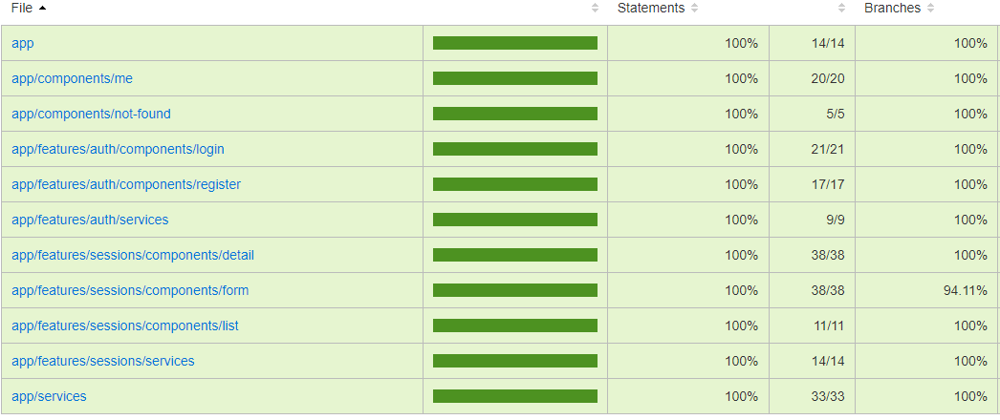
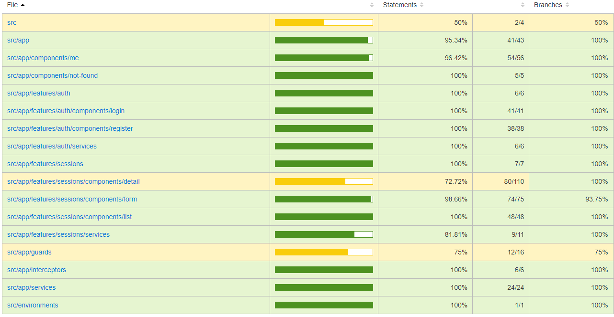
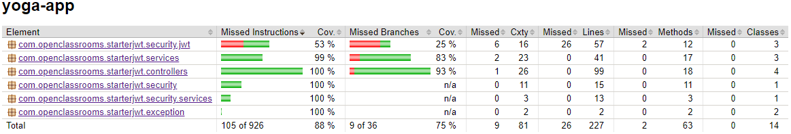

# Yoga App

## <ins>Installation instructions
 - Database:
   - Import `ressources/sql/script.sql` into a freshly created `SavasanaDB` MySQL Database
   - Make sure MySQL service is running and configured on port `3306`
 - Backend:
   - Open the `back` folder inside your IDE
   - Run the command `mvn spring-boot:run` to start the server
 - Frontend:
   - Open the `front` folder inside your IDE
   - Run the command `npm install` to install dependencies
   - Run the command `ng serve` to start the webapp
   - Go to the URL `localhost:4200/` to use the webapp

> Note : Test account is `yoga@studio.com`/`test!1234`

## <ins>Run tests and view Coverage Reports
  - Backend
    - Run the command `mvn integration-test` to run all the tests
    - Run the command `mvn jacoco:report` to generate the coverage report
    - Open `/target/site/jacoco/index.html` to view the coverage report
  - Frontend
    - Run the command `.\node_modules\.bin\jest --coverage` to run all the unitary and integration tests and generate the coverage report
    - Open `/coverage/jest/lcov-report/index.html` to view the unitary/integration tests coverage report
    - Run the command `npm run e2e` to start Cypress, choose your prefered web explorer to run the tests and start the spec named `all`
    - Open `/coverage/lcov-report/index.html` to view the E2E coverage report

## <ins>Coverage Reports

Frontend UT IT Report

Frontend E2E Report

Backend Report
